# VSDBabySoC
VSDBabySoC is a small SoC including PLL, DAC, and a RISCV-based processor named RVMYTH.

# Table of Contents
- [Introduction to the VSDBabySoC](#introduction-to-the-vsdbabysoc)
  - [Problem statement](#problem-statement)
  - [What is SoC](#what-is-soc)
  - [What is RVMYTH](#what-is-rvmyth)
  - [What is PLL](#what-is-pll)
  - [What is DAC](#what-is-dac)
- [VSDBabySoC Modeling](#vsdbabysoc-modeling)
  - [RVMYTH modeling](#rvmyth-modeling)
  - [PLL and DAC modeling](#pll-and-dac-modeling)
  - [Step by step modeling walkthrough](#step-by-step-modeling-walkthrough)
- [OpenLANE](#openlane)
  - [OpenLANE installation](#openlane-installation)
- [Post-synthesis simulation](#post-synthesis-simulation)
  - [Synthesizing using Yosys](#synthesizing-using-yosys)
  - [How to synthesize the design](#how-to-synthesize-the-design)
  - [Post-synthesis simulation (GLS)](#post-synthesis-simulation-gls)
  - [Yosys final report](#yosys-final-report)
  - [Static timing analysis using OpenSTA](#static-timing-analysis-using-opensta)
    - [Static timing analysis on the design](#static-timing-analysis-on-the-design)
- [VSDBabySoC Physical Design](#vsdbabysoc-physical-design)
  - [OpenLANE details and flow](#openlane-details-and-flow)
  - [Other required tools](#other-required-tools)
    - [Magic](#magic)
  - [RVMYTH RTL2GDSII flow](#rvmyth-rtl2gdsii-flow)
    - [RVMYTH layout generation setting up the environment](#rvmyth-layout-generation-setting-up-the-environment)
    - [RVMYTH layout generation flow configuration](#rvmyth-layout-generation-flow-configuration)
    - [RVMYTH layout generation flow running](#rvmyth-layout-generation-flow-running)
    - [RVMYTH post-routing STA](#rvmyth-post-routing-sta)
    - [RVMYTH post-routing simulation](#rvmyth-post-routing-simulation)
    - [RVMYTH final GDSII layout](#rvmyth-final-gdsii-layout)
  - [VSDBabySoC-a mixed-signal RTL2GDSII flow](#vsdbabysoc-a-mixed-signal-rtl2gdsii-flow)
    - [Prerequisites for mixed-signal implementation](#prerequisites-for-mixed-signal-implementation)
      - [LIB file and its usage](#lib-file-and-its-usage)
      - [GDS file and its usage](#gds-file-and-its-usage)
      - [LEF file and its usage](#lef-file-and-its-usage)
      - [AVSDDAC-a ditital to analog converter](#avsddac-a-ditital-to-analog-converter)
        - [AVSDDAC getting the IP core](#avsddac-getting-the-ip-core)
        - [AVSDDAC preparing the LIB file](#avsddac-preparing-the-lib-file)
        - [AVSDDAC preparing the GDS file](#avsddac-preparing-the-gds-file)
        - [AVSDDAC preparing the LEF file](#avsddac-preparing-the-lef-file)
      - [AVSDPLL-a phase-locked-loop](#avsdpll-a-phase-locked-loop)
        - [AVSDPLL Getting the IP core](#avsdpll-getting-the-ip-core)
        - [AVSDPLL Preparing the LIB file](#avsdpll-preparing-the-lib-file)
        - [AVSDPLL Preparing the GDS file](#avsdpll-preparing-the-gds-file)
        - [AVSDPLL Preparing the LEF file](#avsdpll-preparing-the-lef-file)
    - [VSDBabySoC layout generation flow configuration](#vsdbabysoc-layout-generation-flow-configuration)
      - [Creating proper SDC file](#creating-proper-sdc-file)
      - [Floorplanning and placement configurations](#floorplanning-and-placement-configurations)
    - [VSDBabySoC layout generation flow running](#vsdbabysoc-layout-generation-flow-running)
    - [VSDBabySoC post-routing STA](#vsdbabysoc-post-routing-sta)
    - [VSDBabySoC final GDSII layout](#vsdbabysoc-final-gdsii-layout)
- [Future works](#future-works)
- [Contributors](#contributors)
- [Acknowledgements](#acknowledgements)

# Introduction to the VSDBabySoC

VSDBabySoC is a small yet powerful RISCV-based SoC. The main purpose of designing such a small SoC is to test three open-source IP cores together for the first time and calibrate the analog part of it. VSDBabySoC contains one RVMYTH microprocessor, an 8x-PLL to generate a stable clock, and a 10-bit DAC to communicate with other analog devices.

  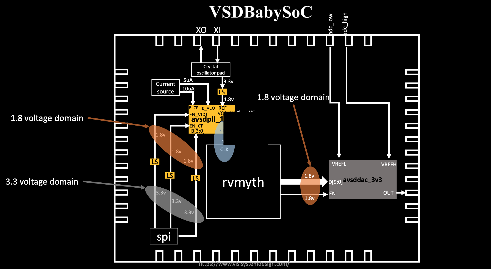

## Problem statement

This work discusses the different aspects of designing a small SoC based on RVMYTH (a RISCV-based processor). This SoC will leverage a PLL as its clock generator and controller and a 10-bit DAC as a way to talk to the outside world. Other electrical devices with proper analog input like televisions, and mobile phones could manipulate DAC output and provide users with music sound or video frames. At the end of the day, it is possible to use this small fully open-source and well-documented SoC which has been fabricated under Sky130 technology, for educational purposes.

## What is SoC

An SoC is a single-die chip that has some different IP cores on it. These IPs could vary from microprocessors (completely digital) to 5G broadband modems (completely analog).

## What is RVMYTH

RVMYTH core is a simple RISCV-based CPU, introduced in a workshop by RedwoodEDA and VSD. During a 5-day workshop students (including middle-schoolers) managed to create a processor from scratch. The workshop used the TLV for faster development. All of the present and future contributions to the IP will be done by students and under open-source licenses.

## What is PLL

A phase-locked loop or PLL is a control system that generates an output signal whose phase is related to the phase of an input signal. PLLs are widely used for synchronization purposes, including clock generation and distribution.

## What is DAC

A digital-to-analog converter or DAC is a system that converts a digital signal into an analog signal. DACs are widely used in modern communication systems enabling the generation of digitally-defined transmission signals. As a result, high-speed DACs are used for mobile communications and ultra-high-speed DACs are employed in optical communications systems.

# VSDBabySoC Modeling

Here we are going to model and simulate the VSDBabySoC using `iverilog`, then we will show the results using `gtkwave` tool. Some initial input signals will be fed into `vsdbabysoc` module that make the pll start generating the proper `CLK` for the circuit. The clock signal will make the `rvmyth` to execute instructions in its `imem`. As a result the register `r17` will be filled with some values cycle by cycle. These values are used by dac core to provide the final output signal named `OUT`. So we have 3 main elements (IP cores) and a wrapper as an SoC and of-course there would be also a testbench module out there.

Please note that in the following sections we will mention some repos that we used to model the SoC. However the main source code is resided in [Source-Code Directory](src) and these modules are in [Modules Sub-Directory](src/module).

## RVMYTH modeling

As we mentioned in [What is RVMYTH](#what-is-rvmyth) section, RVMYTH is designed and created by the TL-Verilog language. So we need a way for compile and trasform it to the Verilog language and use the result in our SoC. Here the `sandpiper-saas` could help us do the job.

  [Here](https://github.com/shivanishah269/risc-v-core) is the repo we used as a reference to model the RVMYTH

## PLL and DAC modeling

It is not possible to sythesis an analog design with Verilog, yet. But there is a chance to simulate it using `real` datatype. We will use the following repositories to model the PLL and DAC cores:

  1. [Here](https://github.com/vsdip/rvmyth_avsdpll_interface) is the repo we used as a reference to model the PLL
  2. [Here](https://github.com/vsdip/rvmyth_avsddac_interface) is the repo we used as a reference to model the DAC

**CAUTION:** In the beginning of the project, we get our verilog model of the PLL from [here](https://github.com/vsdip/rvmyth_avsdpll_interface). However, by proceeding the project to the physical design flow we realize that this model needs a little changes to become sufficient for a real IP core. So we changed it a little and created a new model named `AVSDPLL` based on [this](https://github.com/lakshmi-sathi/avsdpll_1v8) IP

## Step by step modeling walkthrough

In this section we will walk through the whole process of modeling the VSDBabySoC in details. We will increase/decrease the digital output value and feed it to the DAC model so we can watch the changes on the SoC output. Please, note that the following commands are tested on the Ubuntu Bionic (18.04.5) platform and no other OSes.

  1. First we need to install some important packages:

  ```
  $ sudo apt install make python python3 python3-pip git iverilog gtkwave docker.io
  $ sudo chmod 666 /var/run/docker.sock
  $ cd ~
  $ pip3 install pyyaml click sandpiper-saas
  ```

  2. Now we can clone this repository in an arbitrary directory (we'll choose home directory here):

  ```
  $ cd ~
  $ git clone https://github.com/manili/VSDBabySoC.git
  ```

  3. It's time to make the `pre_synth_sim.vcd`:

  ```
  $ cd VSDBabySoC
  $ make pre_synth_sim
  ```
  
  The result of the simulation (i.e. `pre_synth_sim.vcd`) will be stored in the `output/pre_synth_sim` directory.

  4. We can see the waveforms by following command:

  ```
  $ gtkwave output/pre_synth_sim/pre_synth_sim.vcd
  ```
  
  Two most important signals are `CLK` and `OUT`. The `CLK` signal is provided by the PLL and the `OUT` is the output of the DAC model. Here is the final result of the modeling process:
  
  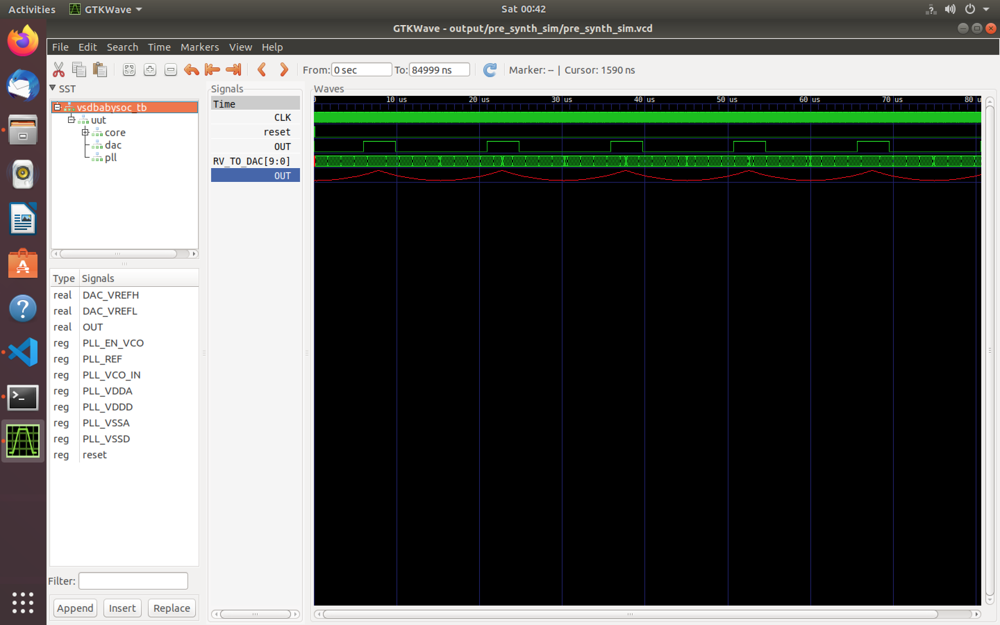

In this picture we can see the following signals:

  * **CLK:** This is the `input CLK` signal of the `RVMYTH` core. This signal comes from the PLL, originally.
  * **reset:** This is the `input reset` signal of the `RVMYTH` core. This signal comes from an external source, originally.
  * **OUT:** This is the `output OUT` signal of the `VSDBabySoC` module. This signal comes from the DAC (due to simulation restrictions it behaves like a digital signal which is incorrect), originally.
  * **RV_TO_DAC[9:0]:** This is the 10-bit `output [9:0] OUT` port of the `RVMYTH` core. This port comes from the RVMYTH register #17, originally.
  * **OUT:** This is a `real` datatype wire which can simulate analog values. It is the `output wire real OUT` signal of the `DAC` module. This signal comes from the DAC, originally.

**PLEASE NOTE** that the sythesis process does not support `real` variables, so we must use the simple `wire` datatype for the `\vsdbabysoc.OUT` instead. The `iverilog` simulator always behaves `wire` as a digital signal. As a result we can not see the analog output via `\vsdbabysoc.OUT` port and we need to use `\dac.OUT` (which is a `real` datatype) instead.

# OpenLANE

OpenLANE is an automated RTL to GDSII flow based on several components including OpenROAD, Yosys, Magic, Netgen, Fault, SPEF-Extractor and custom methodology scripts for design exploration and optimization. The main usage of OpenLANE in this project is for [VSDBabySoC Physical Design](#vsdbabysoc-physical-design). However, we need OpenLANE for the synthesis and STA process in the [Post-synthesis simulation](#post-synthesis-simulation) section. So we'll talk about its installation process here and let the details be until the [VSDBabySoC Physical Design](#vsdbabysoc-physical-design) section.

## OpenLANE installation

The OpenLANE and sky130 installation can be done by following the steps in this repository `https://github.com/nickson-jose/openlane_build_script`.

* More information on OpenLANE can be found in the following repositories:

  * `https://github.com/The-OpenROAD-Project/OpenLane`
  * `https://github.com/efabless/openlane`

To summerize the installation processes:

  ```
  $ git clone https://github.com/The-OpenROAD-Project/OpenLane.git
  $ cd OpenLane/
  $ make openlane
  $ make pdk
  $ make test
  ```

For more info please refer to the GitHub repositories.

**PLEASE NOTE** that currently we are using commit version `8580c248a995b575f7734813b80bb6c4aa82d4f2` for the OpenLANE and our docker image version is `2021.09.09_03.00.48`.

# Post-synthesis simulation

First step in the design flow is to synthesize the generated RTL code and after that we will simulate the result. This way we can find more about our code and its bugs. So in this section we are going to synthesize our code then do a post-synthesis simulation to look for any issues. The post and pre (modeling section) synthesis results should be identical.

## Synthesizing using Yosys

* In OpenLANE the RTL synthesis is performed by `yosys`.
* The technology mapping is performed by `abc`.
* Finally, the timing reports for the synthesized netlist are generated by `OpenSTA`.

## How to synthesize the design

To perform the synthesis process do the following:

  ```
  $ cd ~/VSDBabySoC
  $ make synth
  ```

The heavy job will be done by the script. When the process has been done, we can see the result in the `output/synth/vsdbabysoc.synth.v` file.

## Post-synthesis simulation (GLS)

There is an issue for post-synthesis simulation (Gate-Level Simulation) which can be tracked [here](https://github.com/google/skywater-pdk/issues/310). However, we hacked the source-code by the following instructions and we managed to workaround the issue for now ([here is the reference](https://github.com/The-OpenROAD-Project/OpenLane/issues/518)):

  1. In `$YOUR_PDK_PATH/sky130A/libs.ref/sky130_fd_sc_hd/verilog/sky130_fd_sc_hd.v` file we should manually correct `endif SKY130_FD_SC_HD__LPFLOW_BLEEDER_FUNCTIONAL_V` to `endif //SKY130_FD_SC_HD__LPFLOW_BLEEDER_FUNCTIONAL_V`.
  2. We can simulate with the functional models by passing the `FUNCTIONAL` define to `iverilog`. Also we need to set `UNIT_DELAY` macro to some value. As a result we'll have `iverilog -DFUNCTIONAL -DUNIT_DELAY=#1 <THE SOURCE-CODEs TO BE COMPILED>`.

User could bypass these confusing steps by using our provided Makefile:

  ```
  $ cd ~/VSDBabySoC
  $ make post_synth_sim
  ```
The result of the simulation (i.e. `post_synth_sim.vcd`) will be stored in the `output/post_synth_sim` directory and the waveform could be seen by the following command:

  ```
  $ gtkwave output/post_synth_sim/post_synth_sim.vcd
  ```
Here is the final result:

  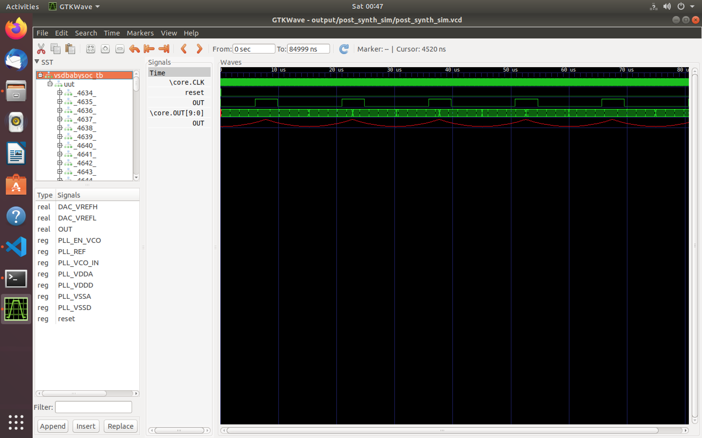

In this picture we can see the following signals:

  * **\core.CLK:** This is the `input CLK` signal of the `RVMYTH` core. This signal comes from the PLL, originally.
  * **reset:** This is the `input reset` signal of the `RVMYTH` core. This signal comes from an external source, originally.
  * **OUT:** This is the `output OUT` signal of the `VSDBabySoC` module. This signal comes from the DAC (due to simulation restrictions it behaves like a digital signal which is incorrect), originally.
  * **\core.OUT[9:0]:** This is the 10-bit `output [9:0] OUT` port of the `RVMYTH` core. This port comes from the RVMYTH register #17, originally.
  * **OUT:** This is a `real` datatype wire which can simulate analog values. It is the `output wire real OUT` signal of the `DAC` module. This signal comes from the DAC, originally.

**PLEASE NOTE** that the sythesis process does not support `real` variables, so we must use the simple `wire` datatype for the `\vsdbabysoc.OUT` instead. The `iverilog` simulator always behaves `wire` as a digital signal. As a result we can not see the analog output via `\vsdbabysoc.OUT` port and we need to use `\dac.OUT` (which is a `real` datatype) instead.

## Yosys final report

  ```
  === vsdbabysoc ===

   Number of wires:               5559
   Number of wire bits:           5559
   Number of public wires:        1323
   Number of public wire bits:    1323
   Number of memories:               0
   Number of memory bits:            0
   Number of processes:              0
   Number of cells:               5552
     avsddac                         1
     avsdpll1v8                      1
     sky130_fd_sc_hd__a211o_2        1
     sky130_fd_sc_hd__a21o_2         4
     sky130_fd_sc_hd__a21oi_2       19
     sky130_fd_sc_hd__a221o_2       56
     sky130_fd_sc_hd__a22o_2        32
     sky130_fd_sc_hd__a2bb2o_2      14
     sky130_fd_sc_hd__a2bb2oi_2     12
     sky130_fd_sc_hd__a311o_2        1
     sky130_fd_sc_hd__a31o_2         7
     sky130_fd_sc_hd__a31oi_2        3
     sky130_fd_sc_hd__a32o_2         8
     sky130_fd_sc_hd__a41o_2         1
     sky130_fd_sc_hd__and2_2        38
     sky130_fd_sc_hd__and3_2         5
     sky130_fd_sc_hd__and4b_2        1
     sky130_fd_sc_hd__buf_1        885
     sky130_fd_sc_hd__conb_1         6
     sky130_fd_sc_hd__dfxtp_2     1144
     sky130_fd_sc_hd__inv_2       1026
     sky130_fd_sc_hd__mux2_1       513
     sky130_fd_sc_hd__nand2_2        3
     sky130_fd_sc_hd__nand4_2       32
     sky130_fd_sc_hd__nor2_2        61
     sky130_fd_sc_hd__nor2b_2        1
     sky130_fd_sc_hd__nor4_2         2
     sky130_fd_sc_hd__o2111a_2       1
     sky130_fd_sc_hd__o2111ai_2     65
     sky130_fd_sc_hd__o211a_2        4
     sky130_fd_sc_hd__o21a_2         6
     sky130_fd_sc_hd__o21ai_2        9
     sky130_fd_sc_hd__o221a_2      955
     sky130_fd_sc_hd__o221ai_2       2
     sky130_fd_sc_hd__o22a_2       427
     sky130_fd_sc_hd__o2bb2a_2      23
     sky130_fd_sc_hd__o2bb2ai_2      2
     sky130_fd_sc_hd__o311a_2        2
     sky130_fd_sc_hd__o31a_2        10
     sky130_fd_sc_hd__o32a_2        15
     sky130_fd_sc_hd__or2_2         48
     sky130_fd_sc_hd__or2b_2        32
     sky130_fd_sc_hd__or3_2         35
     sky130_fd_sc_hd__or4_2         36
     sky130_fd_sc_hd__or4b_2         3

   Area for cell type \avsddac is unknown!
   Area for cell type \avsdpll1v8 is unknown!

   Chip area for module '\vsdbabysoc': 58173.292800
  ```

## Static timing analysis using OpenSTA

OpenSTA is a gate level static timing verifier. As a stand-alone executable it can be used to verify the timing of a design using standard file formats. For more info about the OpenSTA see [here](https://github.com/The-OpenROAD-Project/OpenSTA).

### Static timing analysis on the design

Due to lack of the proper PLL and DAC liberty files for complete/correct STA, we should consider the output port of the PLL (PLL.CLK) as the clock and analyze the timing of the RVMYTH core. Here is the SDC file content:

  ```
  set_units -time ns
  create_clock [get_pins {pll/CLK}] -name clk -period 11
  ```

Now to start the analyzing process we should do the following:

  ```
  $ cd ~/VSDBabySoC
  $ make sta
  ```

And now here is the output of the OpenSTA tool:

  ```
  Startpoint: _9532_ (rising edge-triggered flip-flop clocked by clk)
  Endpoint: _10034_ (rising edge-triggered flip-flop clocked by clk)
  Path Group: clk
  Path Type: max

    Delay    Time   Description
  ---------------------------------------------------------
     0.00    0.00   clock clk (rise edge)
     0.00    0.00   clock network delay (ideal)
     0.00    0.00 ^ _9532_/CLK (sky130_fd_sc_hd__dfxtp_1)
     4.40    4.40 ^ _9532_/Q (sky130_fd_sc_hd__dfxtp_1)
     5.06    9.47 v _8103_/Y (sky130_fd_sc_hd__clkinv_1)
     0.54   10.01 ^ _8106_/Y (sky130_fd_sc_hd__o211ai_1)
     0.00   10.01 ^ _10034_/D (sky130_fd_sc_hd__dfxtp_1)
            10.01   data arrival time

    11.00   11.00   clock clk (rise edge)
     0.00   11.00   clock network delay (ideal)
     0.00   11.00   clock reconvergence pessimism
            11.00 ^ _10034_/CLK (sky130_fd_sc_hd__dfxtp_1)
    -0.13   10.87   library setup time
            10.87   data required time
  ---------------------------------------------------------
            10.87   data required time
           -10.01   data arrival time
  ---------------------------------------------------------
             0.86   slack (MET)
  ```

# VSDBabySoC Physical Design

In integrated circuit design, physical design is a step in the standard design cycle which follows after the circuit design. At this step, circuit representations of the components (devices and interconnects) of the design are converted into geometric representations of shapes which, when manufactured in the corresponding layers of materials, will ensure the required functioning of the components. This geometric representation is called integrated circuit layout. This step is usually split into several sub-steps, which include both design and verification and validation of the layout.

  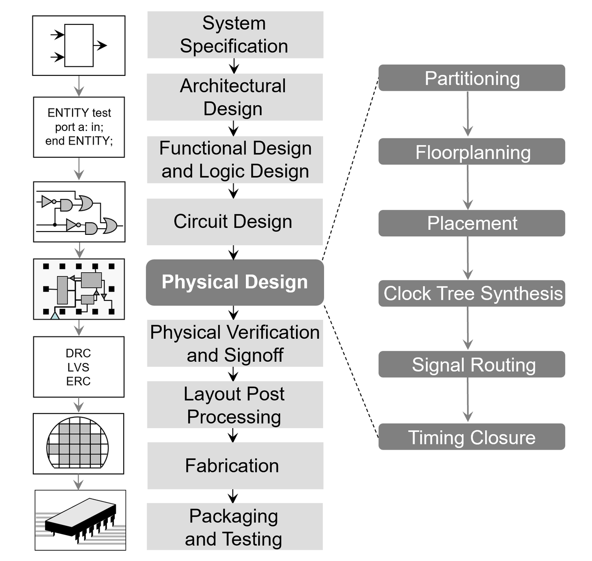

## OpenLANE details and flow

Here is the picture of the OpenLANE architecture:

  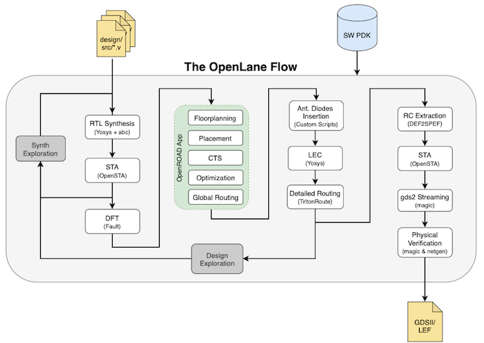

OpenLANE flow consists of several stages. By default all flow steps are run in sequence. Each stage may consist of multiple sub-stages. Lots of info about the flow and its internal tools can be found [Here](https://github.com/The-OpenROAD-Project/OpenLane/blob/master/README.md).

  * [This](https://github.com/The-OpenROAD-Project/OpenLane/blob/master/docs/source/advanced_readme.md) link contains info about how to run OpenLANE in `interactive` mode.
  * [This](https://github.com/The-OpenROAD-Project/OpenLane/blob/master/configuration/README.md) link contains info about different variables for configuration.
  * [This](https://github.com/The-OpenROAD-Project/OpenLane/blob/master/docs/source/hardening_macros.md) link contains info about building hard macros using OpenLANE.

We'll leverage info of these links during the project to build the VSDBabySoC layout.

## Other required tools

Although OpenLANE integrates all required tools in its flow, sometimes we need to use a toolset direcltly from our host OS/Ubuntu. As an example it is not possible to open GUI of the `Magic VLSI Layout` software from the OpenLANE docker container due to container command line nature. So we need to install the tool on our main OS/Ubuntu and open it from there (not the container).

### Magic

[Magic](https://github.com/RTimothyEdwards/magic) is a venerable VLSI layout tool, written in the 1980's at Berkeley by John Ousterhout, now famous primarily for writing the scripting interpreter language Tcl. Due largely in part to its liberal Berkeley open-source license, magic has remained popular with universities and small companies. The open-source license has allowed VLSI engineers with a bent toward programming to implement clever ideas and help magic stay abreast of fabrication technology. However, it is the well thought-out core algorithms which lend to magic the greatest part of its popularity. Magic is widely cited as being the easiest tool to use for circuit layout, even for people who ultimately rely on commercial tools for their product design flow. [Here](https://github.com/RTimothyEdwards/magic/blob/master/INSTALL) is how to install it on a machine.

## RVMYTH RTL2GDSII flow

Here we are going to implement a fully digital design using OpenLANE. This way we can get our hands dirty and learn a lot about the OpenLANE flow. Implementing mixed-signal layout without gathering knowledge of this step is pretty much tough.

### RVMYTH layout generation setting up the environment

We are using `OPENLANE_PATH` environment variable to reference the OpenLANE installed directory. As an example imagine we have installed the OpenLANE in the `~/OpenLane` directory, so the value of the `OPENLANE_PATH` variable would be `~/OpenLane`. This value should be changed in the [Makefile](Makefile#L6) before any progress.

### RVMYTH layout generation flow configuration

We have provided minimum required configurations in [this](src/layout_conf/rvmyth/config.tcl) file. However, the file could be changed accorting to other requirements. This file will be copied directly to the OpenLANE `designs/rvmyth` folder for layout implementation.

### RVMYTH layout generation flow running

The RVMYTH layout generation flow could be all started by the following command.

  ```
  $make rvmyth_layout
  ```

[The script](Makefile#L75) will take care of the rest of the process. The process should take about 20mins depending on the PC/laptop hardware configurations. After that results can be found in the `output/rvmyth_layout` folder.

### RVMYTH post-routing simulation

The following command will produce a file named `post_routing_sim.vcd` which can be used to simulate post-routing and powered model.

  ```
  $make rvmyth_post_routing_sim
  $gtkwave out/rvmyth_layout/post_routing_sim.vcd
  ```

Here is the result.

  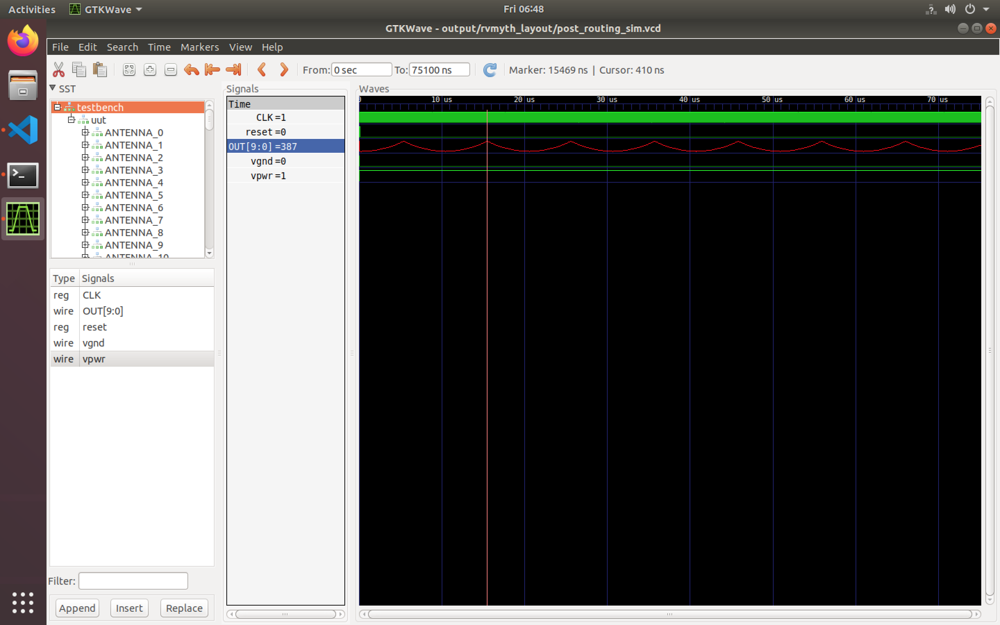

As it can be seen the result is exactly the same as the previous results.

### RVMYTH post-routing STA

In this step we are going to do STA on the RVMYTH design. First we should create a timing database that we will query for STA. Follow the instructions:

  ```
  $make mount
  $./flow.tcl -design rvmyth -tag rvmyth_test -interactive | tee /VSDBabySoC/output/rvmyth_layout/sta.log
  %openroad
  %read_lef designs/rvmyth/runs/rvmyth_test/tmp/merged.lef
  %read_def designs/rvmyth/runs/rvmyth_test/results/cts/rvmyth.cts.def
  %write_db designs/rvmyth/runs/rvmyth_test/rvmyth.db
  ```

Now we can query the database and excract the STA out of it by the following commands (**NOTE** that we are still in **OpenROAD** environment o/w we should re-enter the environment):

  ```
  %read_db designs/rvmyth/runs/rvmyth_test/rvmyth.db
  %read_verilog designs/rvmyth/runs/rvmyth_test/results/lvs/rvmyth.lvs.powered.v
  %read_liberty $::env(LIB_SYNTH_COMPLETE)
  %link_design rvmyth
  %read_sdc scripts/base.sdc
  %set_propagated_clock [all_clocks]
  %report_checks -path_delay min_max -format full_clock_expanded -digits 4
  %exit
  %exit
  $exit
  ```

Here is the `min_max` analysis result:

  ```
  Startpoint: _09644_ (rising edge-triggered flip-flop clocked by CLK)
  Endpoint: _09612_ (rising edge-triggered flip-flop clocked by CLK)
  Path Group: CLK
  Path Type: min

      Delay      Time   Description
  -------------------------------------------------------------
     0.0000    0.0000   clock CLK (rise edge)
     0.0000    0.0000   clock source latency
     0.0100    0.0100 ^ CLK (in)
     0.1302    0.1402 ^ clkbuf_0_CLK/X (sky130_fd_sc_hd__clkbuf_16)
     0.2797    0.4199 ^ clkbuf_4_7_0_CLK/X (sky130_fd_sc_hd__clkbuf_1)
     0.2127    0.6326 ^ clkbuf_leaf_21_CLK/X (sky130_fd_sc_hd__clkbuf_16)
     0.0000    0.6326 ^ _09644_/CLK (sky130_fd_sc_hd__dfxtp_1)
     0.3158    0.9484 v _09644_/Q (sky130_fd_sc_hd__dfxtp_1)
     0.0000    0.9484 v _09612_/D (sky130_fd_sc_hd__dfxtp_2)
               0.9484   data arrival time

     0.0000    0.0000   clock CLK (rise edge)
     0.0000    0.0000   clock source latency
     0.0100    0.0100 ^ CLK (in)
     0.1302    0.1402 ^ clkbuf_0_CLK/X (sky130_fd_sc_hd__clkbuf_16)
     0.4999    0.6401 ^ clkbuf_4_12_0_CLK/X (sky130_fd_sc_hd__clkbuf_1)
     0.2775    0.9176 ^ clkbuf_leaf_42_CLK/X (sky130_fd_sc_hd__clkbuf_16)
     0.0000    0.9176 ^ _09612_/CLK (sky130_fd_sc_hd__dfxtp_2)
     0.0000    0.9176   clock reconvergence pessimism
    -0.0434    0.8741   library hold time
               0.8741   data required time
  -------------------------------------------------------------
               0.8741   data required time
              -0.9484   data arrival time
  -------------------------------------------------------------
               0.0743   slack (MET)


  Startpoint: _09572_ (rising edge-triggered flip-flop clocked by CLK)
  Endpoint: OUT[5] (output port clocked by CLK)
  Path Group: CLK
  Path Type: max

      Delay      Time   Description
  -------------------------------------------------------------
     0.0000    0.0000   clock CLK (rise edge)
     0.0000    0.0000   clock source latency
     0.0100    0.0100 ^ CLK (in)
     0.1302    0.1402 ^ clkbuf_0_CLK/X (sky130_fd_sc_hd__clkbuf_16)
     0.6871    0.8273 ^ clkbuf_4_8_0_CLK/X (sky130_fd_sc_hd__clkbuf_1)
     0.2944    1.1217 ^ clkbuf_leaf_97_CLK/X (sky130_fd_sc_hd__clkbuf_16)
     0.0000    1.1217 ^ _09572_/CLK (sky130_fd_sc_hd__dfxtp_1)
     0.3045    1.4261 ^ _09572_/Q (sky130_fd_sc_hd__dfxtp_1)
     0.1444    1.5706 ^ output7/X (sky130_fd_sc_hd__clkbuf_2)
     0.0000    1.5706 ^ OUT[5] (out)
               1.5706   data arrival time

    20.0000   20.0000   clock CLK (rise edge)
     0.0000   20.0000   clock network delay (propagated)
     0.0000   20.0000   clock reconvergence pessimism
    -4.0000   16.0000   output external delay
              16.0000   data required time
  -------------------------------------------------------------
              16.0000   data required time
              -1.5706   data arrival time
  -------------------------------------------------------------
              14.4294   slack (MET)
  ```

The report can be found in `output/rvmyth_layout/sta.log` file.

### RVMYTH final GDSII layout

To see the final GDSII layout, we must first change directory to `output/rvmyth_layout/rvmyth_test/results/magic` (because we need to access `.magicrc` file) and then open the `rvmyth.gds` file by `magic` software. So here it is:

  ```
  $cd ~/VSDBabySoC
  $cd output/rvmyth_layout/rvmyth_test/results/magic
  $magic rvmyth.gds
  ```
Now here is the final result of the RVMYTH GDSII layout.

  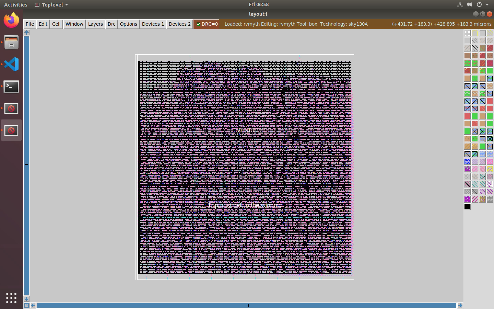

## VSDBabySoC-a mixed-signal RTL2GDSII flow

As we know VSDBabySoC is a small mixed-signal SoC that contains a PLL, a DAC, and a RISCV-based processor named RVMYTH. All of these IP cores -from digital to analog- brought to us by **VLSI-System-Design (VSD)** students which shows a greate potential in the community. Two main contributions of this work are:

  1. Building the SoC all around the student wroks.
  2. Automating mixed-signal physical design flow by open-source tools (i.e. OpenLANE).

In this section we are going to talk about how to implement our design, in detail.

### Prerequisites for mixed-signal implementation

To start physical design process of a mixed-signal chip by the OpenLANE flow we need to provide three files per each analog IP. OpenLANE will use these informations to create final GDSII layout. Here they are:

#### LIB file and its usage

The .lib file is an ASCII representation of the timing and power parameters associated with any cell in a particular semiconductor technology
The timing and power parameters are obtained by simulating the cells under a variety of conditions and the data is represented in the .lib format
The .lib file contains timing models and data to calculate

  * I/O delay paths
  * Timing check values 
  * Interconnect delays

I/O path delays and timing check values are computed on a per-instance basis. [Reference](https://www.csee.umbc.edu/courses/graduate/CMPE641/Fall08/cpatel2/slides/lect05_LIB.pdf)

In mixed-signal design, we instantiate the analog IP cores (e.g. PLL and DAC) as a black-box, and the synthesizer and STA tool will use .lib info to do their tasks. Unfortunately, there is no free open-source tools to extract the timing and power info from the final spice model. So we'll use a fake .lib file for our IP cores that will be generated by a perl script.

#### GDS file and its usage

GDSII stream format, common acronym GDSII (or GDS), is a database file format which is the de facto industry standard for data exchange of integrated circuit or IC layout artwork. It is a binary file format representing planar geometric shapes, text labels, and other information about the layout in hierarchical form. The data can be used to reconstruct all or part of the artwork to be used in sharing layouts, transferring artwork between different tools, or creating photomasks. [Reference](https://en.wikipedia.org/wiki/GDSII)
In this project we'll need GDS file for two main reasons:

  1. To extract the LEF file out of it (we'll cover the LEF file usage in the next topic.)
  2. To create final full GDS layout

#### LEF file and its usage

For a PnR tool to correctly place and route a block (a macro or a std. cell), it doesn't need to know entire layout information of the block; just the pin positions, PR boundary is sufficient. These minimal and abstracted information is provided to the tool by the Library Exchange Format (LEF) file. LEF file also serves the purpose of protecting intellectual property and is basically of two types:
- Cell LEF - It's an abstract view of the cell and only gives information about PR boundary, pin position and metal layer information of the cell.
- Technology LEF - It contains information about available metal layer, via information, DRCs of particular technology used by placer and router and so on. [Reference](https://github.com/nickson-jose/vsdstdcelldesign/blob/master/README.md#introduction-to-lef)
The below diagram highlights the difference between a layout and a LEF (**Image Courtesy:** Google):

  

#### AVSDDAC-a ditital to analog converter

In this section we are going to talk about how to provide OpenLANE with those three files (i.e. LIB, GDS, LEF) of the AVSDDAC.

##### AVSDDAC getting the IP core

We used the DAC IP of [this](https://github.com/vsdip/avsddac_3v3_sky130_v1) link as our reference DAC IP core. So first we need to clone the GitHub repo in an arbitrary directory (our choose is home).

  ```
  $cd ~
  $git clone https://github.com/vsdip/avsddac_3v3_sky130_v1.git
  ```

##### AVSDDAC preparing the LIB file

To create the .lib file, first we need a verilog model as an input for the perl script. Then by typing the following command in the terminal our `avsddac.lib` file will be generated. **PLEASE NOTE** that the verilog file needs to be in the same folder of the perl script.

  ```
  $cd <PATH_TO_THE_SCRIPT>
  $cp <PATH_TO_INPUT_MODEL>/<MODEL>.v ./
  $perl verilog_to_lib.pl <MODEL>.v <OUTPUT_NAME>
  $rm <MODEL>.v
  $mv <OUTPUT_NAME>.lib <DESTINATION_PATH>
  ```

As a result for AVSDDAC we'll have:

  ```
  $cd ~/VSDBabySoC/src/script
  $cp ../module/avsddac.v ./
  $perl verilog_to_lib.pl avsddac.v avsddac
  $rm avsddac.v
  $mv avsddac.lib ../lib
  ```

It is also possible to use our pre-build lib file in the `lib` folder.

##### AVSDDAC preparing the GDS file

We can extract the GDS file of the AVSDDAC IP core from the `user_analog_project_wrapper.gds` file by following these instructions:

  1. Change directory to the folder which contains `user_analog_project_wrapper.gds` file:

  ```
  $cd ~/avsddac_3v3_sky130_v1/gds
  ```

  2. Open `user_analog_project_wrapper.gds` file by the `Magic` tool:

  ```
  $magic user_analog_project_wrapper.gds -T ../mag/sky130A.tech
  ```

  3. Select the `10bitdac_cap_layout_design` box by hovering mouse over it and press `S` key on the keyboard. Now the box should be selected by white borders surround it just like the following picture.

  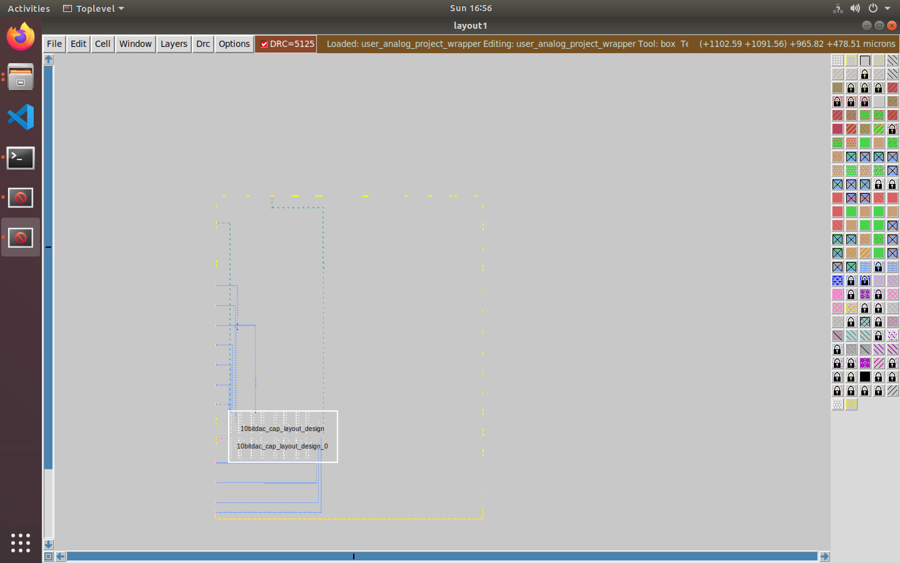

  4. Now press `X` to extract whatever inside the `10bitdac_cap_layout_design` box. We can zoom-in by pressing `Z` key on the keyboard or by typing `findbox zoom` in the `tkcon` console of the `Magic` app. Also we can zoom-out by pressing `SHIFT + Z` keys on our keyboard. Here is the result:

  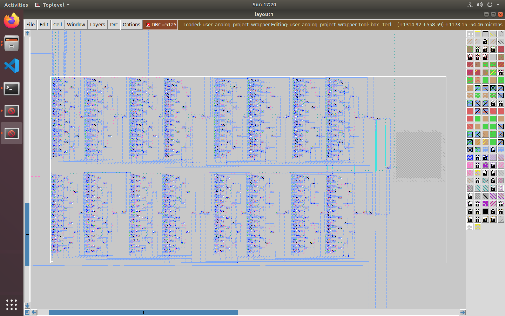

  5. By typing the following commands in the `tkcon`, we are going to create a new cell named `avsddac` from whatever inside the white box and load it as a new layout:

  ```
  %flatten -dobox avsddac
  %load avsddac
  ```

  6. Select the whole layout by hovering mouse in free gray area and pressing `S` on the keyboard. Then switch to `Full View` mode by pressing `V`. Result should be like this:

  

  7. Now all labels of the design should be removed by typing the following instruction in the `tkcon` (**NOTE** that we sould keep whole cell selected as the 6th step while executing the command.):

  ```
  %erase label
  ```
  8. Now we can save the layout by this command:

  ```
  %gds
  ```

  **NOTE** that during the execution of `gds` command and saving process, an error like `1 problems occurred.  See feedback entries.` may happen which is safe to ignore.

  9. Now we can close the `Magic` app by closing the `tkcon` window and press `Yes` button.

##### AVSDDAC preparing the LEF file


#### AVSDPLL-a phase-locked-loop

In this section we are going to talk about how to provide OpenLANE with those three files (i.e. LIB, GDS, LEF) of the AVSDPLL (AVSDPLL1_v8).

##### AVSDPLL Getting the IP core

We used the PLL IP of [this](https://github.com/lakshmi-sathi/avsdpll_1v8) link as our reference PLL IP core. So first we need to clone the GitHub repo in an arbitrary directory (our choose is home).

  ```
  $cd ~
  $git clone https://github.com/lakshmi-sathi/avsdpll_1v8.git
  ```

##### AVSDPLL Preparing the LIB file

To create the .lib file, first we need a verilog model as an input for the perl script. Then by typing the following command in the terminal our `avsdpll.lib` file will be generated. **PLEASE NOTE** that the verilog file needs to be in the same folder of the perl script.

  ```
  $cd <PATH_TO_THE_SCRIPT>
  $cp <PATH_TO_INPUT_MODEL>/<MODEL>.v ./
  $perl verilog_to_lib.pl <MODEL>.v <OUTPUT_NAME>
  $rm <MODEL>.v
  $mv <OUTPUT_NAME>.lib <DESTINATION_PATH>
  ```

As a result for AVSDPLL we'll have:

  ```
  $cd ~/VSDBabySoC/src/script
  $cp ../module/avsdpll.v ./
  $perl verilog_to_lib.pl avsdpll.v avsdpll
  $rm avsdpll.v
  $mv avsdpll.lib ../lib
  ```

It is also possible to use our pre-build lib file in the `lib` folder.

##### AVSDPLL Preparing the GDS file

To extract the GDS file from GitHub repo, we should first open the `PLL.mag` file with `Magic` tool and then create the GDS from it. So these instructions should be followed:

  1. Change directory to the `~/avsdpll_1v8/Layout` folder.

  ```
  $cd ~/avsdpll_1v8/Layout
  ```

  2. Open `PLL.mag` file by following command:

  ```
  $magic PLL.mag -T ../sky130A.tech
  ```

  3. Select the whole layout by hovering mouse in free gray area and pressing `S` on the keyboard. Then switch to `Full View` mode by pressing `V`. Result should be like this:

  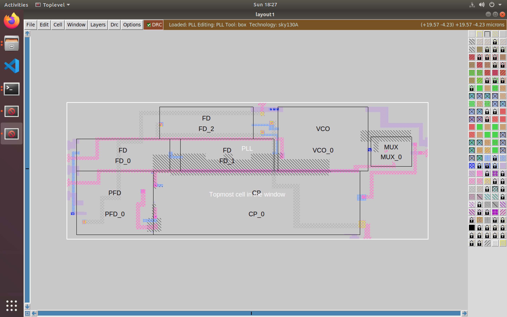

  4. Now press `X` to extract whatever inside the `PLL` box.

  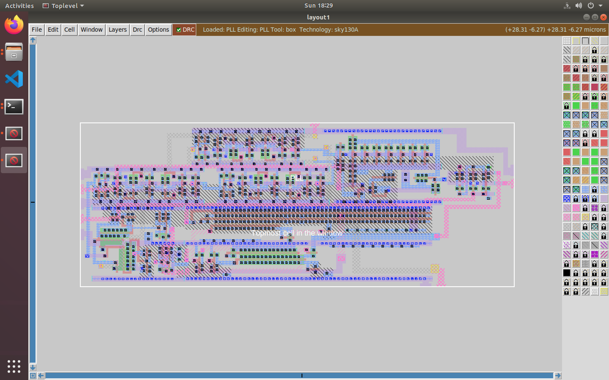

  5. Rename the `PLL` cell to `avsdpll` by typing this command in the `tkcon`:

  ```
  %cellname rename PLL avsdpll
  ```

  6. Now we can save the layout by this command:

  ```
  %gds
  ```

  7. Now the `Magic` app could be closed by closing the `tkcon` window and press `Yes` button.

##### AVSDPLL Preparing the LEF file


### VSDBabySoC layout generation flow configuration

We have provided minimum required configurations in [this](src/layout_conf/vsdbabysoc/config.tcl) file. However, the file could be changed accorting to other requirements. This file will be copied directly to the OpenLANE `designs/vsdbabysoc` folder for layout implementation.

#### Creating proper SDC file

VSDBabySoC does not have an external clock input because of the PLL IP core. So we need to find a way to introduce the `pll.CLK` output as the design (SoC) clock for both STA an CTS. As a result we created a custom SDC file describing our special clock source. Here is the main part of it:

  ```
  set ::env(CLOCK_PORT) [get_pins {pll/CLK}]
  set ::env(CLOCK_NET) {core.CLK}
  ```

In the first line we are trying to introduce the CLK output pin of the PLL as our clock port/pin. In the second line we're introducing the CLK net of the RVMYTH as the main clock net so the CTS could use it for clock tree synthesizing. **PLEASE NOTE** that both `CLOCK_PORT` and `CLOCK_NET` environments need to be filled with these info otherwise will have issues during the physical design flow.

#### Floorplanning and placement configurations

  * Our design contains some analog IP macros (i.e. PLL and DAC). Locations of these macros should be specified by the designer for better floorplanning and placement. If the designer does not specify locations of these macros, it may lead to OpenLANE flow failure. As a result we'll specify locations in [this](src/layout_conf/vsdbabysoc/macro.cfg) file.
  * It is also a good idea to choose proper locations for pins. This may significantly improve routing-phase speed and output. As a result we tried to specify locations of pins in [this](src/layout_conf/vsdbabysoc/pin_order.cfg) file.
  * Another important factor of floorplanning and placement configurations, is the pin margin. Sometimes due to routing limitations, wires may exceed core boarders. As a result pins may stay behind/overlap the wires which will lead to OpenLANE flow failure. By changing this factor we can increase chip boarders and push the pins to the boarders to prevent any kind of overlapping.

### VSDBabySoC layout generation flow running

The VSDBabySoC layout generation flow could be all started by the following command.

  ```
  $make vsdbabysoc_layout
  ```

[The script](Makefile#L127) will take care of the rest of the process. The process should take about 30mins depending on the PC/laptop hardware configurations. After that results can be found in the `output/vsdbabysoc_layout` folder.

### VSDBabySoC post-routing STA

As we mentioned in the [RVMYTH post-routing STA](#rvmyth-post-routing-sta) section, in this step we are going to do STA on the VSDBabySoC design. First we should create a timing database that we will query for STA. Follow the instructions:

  ```
  $make mount
  $./flow.tcl -design vsdbabysoc -tag vsdbabysoc_test -interactive | tee /VSDBabySoC/output/vsdbabysoc_layout/sta.log
  %openroad
  %read_lef designs/vsdbabysoc/runs/vsdbabysoc_test/tmp/merged.lef
  %read_def designs/vsdbabysoc/runs/vsdbabysoc_test/results/cts/vsdbabysoc.cts.def
  %write_db designs/vsdbabysoc/runs/vsdbabysoc_test/vsdbabysoc.db
  ```

Now we can query the database and excract the STA out of it by the following commands (**NOTE** that we are still in **OpenROAD** environment o/w we should re-enter the environment):

  ```
  %read_db designs/vsdbabysoc/runs/vsdbabysoc_test/vsdbabysoc.db
  %read_verilog designs/vsdbabysoc/runs/vsdbabysoc_test/results/lvs/vsdbabysoc.lvs.powered.v
  %read_liberty $::env(LIB_SYNTH_COMPLETE)
  %link_design vsdbabysoc
  %read_sdc designs/vsdbabysoc/src/vsdbabysoc_layout.sdc
  %set_propagated_clock [all_clocks]
  %report_checks -path_delay min_max -format full_clock_expanded -digits 4
  %exit
  %exit
  $exit
  ```

Here is the `min_max` analysis result:

  ```
  Startpoint: _09726_ (rising edge-triggered flip-flop clocked by _20d7f40700000000_p_Pin)
  Endpoint: _09716_ (rising edge-triggered flip-flop clocked by _20d7f40700000000_p_Pin)
  Path Group: _20d7f40700000000_p_Pin
  Path Type: min

      Delay      Time   Description
  -------------------------------------------------------------
     0.0000    0.0000   clock _20d7f40700000000_p_Pin (rise edge)
     0.0000    0.0000   clock source latency
     0.0000    0.0000 ^ pll/CLK (avsdpll)
     0.0941    0.0941 ^ clkbuf_0_core.CLK/X (sky130_fd_sc_hd__clkbuf_16)
     0.0697    0.1638 ^ clkbuf_1_0_0_core.CLK/X (sky130_fd_sc_hd__clkbuf_1)
     0.0910    0.2548 ^ clkbuf_1_0_1_core.CLK/X (sky130_fd_sc_hd__clkbuf_1)
     0.0987    0.3536 ^ clkbuf_2_0_0_core.CLK/X (sky130_fd_sc_hd__clkbuf_1)
     0.0988    0.4523 ^ clkbuf_3_0_0_core.CLK/X (sky130_fd_sc_hd__clkbuf_1)
     0.3767    0.8290 ^ clkbuf_4_0_0_core.CLK/X (sky130_fd_sc_hd__clkbuf_1)
     0.2156    1.0446 ^ clkbuf_leaf_122_core.CLK/X (sky130_fd_sc_hd__clkbuf_16)
     0.0000    1.0446 ^ _09726_/CLK (sky130_fd_sc_hd__dfxtp_4)
     0.3178    1.3625 ^ _09726_/Q (sky130_fd_sc_hd__dfxtp_4)
     0.0000    1.3625 ^ _09716_/D (sky130_fd_sc_hd__dfxtp_4)
               1.3625   data arrival time

     0.0000    0.0000   clock _20d7f40700000000_p_Pin (rise edge)
     0.0000    0.0000   clock source latency
     0.0000    0.0000 ^ pll/CLK (avsdpll)
     0.0941    0.0941 ^ clkbuf_0_core.CLK/X (sky130_fd_sc_hd__clkbuf_16)
     0.0697    0.1638 ^ clkbuf_1_1_0_core.CLK/X (sky130_fd_sc_hd__clkbuf_1)
     0.0982    0.2620 ^ clkbuf_1_1_1_core.CLK/X (sky130_fd_sc_hd__clkbuf_1)
     0.1015    0.3635 ^ clkbuf_2_2_0_core.CLK/X (sky130_fd_sc_hd__clkbuf_1)
     0.0988    0.4622 ^ clkbuf_3_5_0_core.CLK/X (sky130_fd_sc_hd__clkbuf_1)
     0.3767    0.8389 ^ clkbuf_4_10_0_core.CLK/X (sky130_fd_sc_hd__clkbuf_1)
     0.2215    1.0604 ^ clkbuf_opt_3_0_core.CLK/X (sky130_fd_sc_hd__clkbuf_16)
     0.1079    1.1683 ^ clkbuf_leaf_7_core.CLK/X (sky130_fd_sc_hd__clkbuf_16)
     0.0000    1.1683 ^ _09716_/CLK (sky130_fd_sc_hd__dfxtp_4)
     0.0000    1.1683   clock reconvergence pessimism
    -0.0301    1.1382   library hold time
               1.1382   data required time
  -------------------------------------------------------------
               1.1382   data required time
              -1.3625   data arrival time
  -------------------------------------------------------------
               0.2243   slack (MET)


  Startpoint: _09616_ (rising edge-triggered flip-flop clocked by _20d7f40700000000_p_Pin)
  Endpoint: _10369_ (rising edge-triggered flip-flop clocked by _20d7f40700000000_p_Pin)
  Path Group: _20d7f40700000000_p_Pin
  Path Type: max

      Delay      Time   Description
  -------------------------------------------------------------
     0.0000    0.0000   clock _20d7f40700000000_p_Pin (rise edge)
     0.0000    0.0000   clock source latency
     0.0000    0.0000 ^ pll/CLK (avsdpll)
     0.0941    0.0941 ^ clkbuf_0_core.CLK/X (sky130_fd_sc_hd__clkbuf_16)
     0.0697    0.1638 ^ clkbuf_1_1_0_core.CLK/X (sky130_fd_sc_hd__clkbuf_1)
     0.0982    0.2620 ^ clkbuf_1_1_1_core.CLK/X (sky130_fd_sc_hd__clkbuf_1)
     0.1015    0.3635 ^ clkbuf_2_3_0_core.CLK/X (sky130_fd_sc_hd__clkbuf_1)
     0.0988    0.4622 ^ clkbuf_3_6_0_core.CLK/X (sky130_fd_sc_hd__clkbuf_1)
     0.6264    1.0886 ^ clkbuf_4_13_0_core.CLK/X (sky130_fd_sc_hd__clkbuf_1)
     0.2892    1.3779 ^ clkbuf_leaf_51_core.CLK/X (sky130_fd_sc_hd__clkbuf_16)
     0.0000    1.3779 ^ _09616_/CLK (sky130_fd_sc_hd__dfxtp_1)
     0.3062    1.6840 v _09616_/Q (sky130_fd_sc_hd__dfxtp_1)
     0.1262    1.8102 v _06804_/X (sky130_fd_sc_hd__clkbuf_2)
     0.0806    1.8908 ^ _06970_/Y (sky130_fd_sc_hd__inv_2)
     0.0620    1.9528 v _06971_/Y (sky130_fd_sc_hd__nor2_1)
     0.1709    2.1238 ^ _06972_/Y (sky130_fd_sc_hd__a21oi_1)
     0.0471    2.1709 v _06975_/Y (sky130_fd_sc_hd__inv_2)
     0.4843    2.6552 v _07025_/X (sky130_fd_sc_hd__or4b_1)
     0.2211    2.8763 v _07030_/X (sky130_fd_sc_hd__o211a_1)
     0.2285    3.1048 v _07163_/X (sky130_fd_sc_hd__o221a_1)
     0.3643    3.4690 v _07291_/X (sky130_fd_sc_hd__o311a_2)
     0.2678    3.7368 v _07329_/X (sky130_fd_sc_hd__o31a_1)
     0.1614    3.8982 v _07344_/X (sky130_fd_sc_hd__o22a_1)
     0.2762    4.1744 v _07345_/X (sky130_fd_sc_hd__o2bb2a_1)
     0.2686    4.4430 v _09300_/X (sky130_fd_sc_hd__mux2_1)
     0.2657    4.7087 v _09301_/X (sky130_fd_sc_hd__mux2_1)
     0.2657    4.9743 v _09302_/X (sky130_fd_sc_hd__mux2_1)
     0.2657    5.2400 v _09303_/X (sky130_fd_sc_hd__mux2_1)
     0.2958    5.5358 v _09304_/X (sky130_fd_sc_hd__mux2_1)
     0.2790    5.8148 v _09192_/X (sky130_fd_sc_hd__mux2_2)
     0.1733    5.9881 v _05348_/X (sky130_fd_sc_hd__dlymetal6s2s_1)
     0.2202    6.2082 v _05598_/X (sky130_fd_sc_hd__o221a_1)
     0.0000    6.2082 v _10369_/D (sky130_fd_sc_hd__dfxtp_1)
               6.2082   data arrival time

    20.0000   20.0000   clock _20d7f40700000000_p_Pin (rise edge)
     0.0000   20.0000   clock source latency
     0.0000   20.0000 ^ pll/CLK (avsdpll)
     0.0941   20.0941 ^ clkbuf_0_core.CLK/X (sky130_fd_sc_hd__clkbuf_16)
     0.0697   20.1638 ^ clkbuf_1_0_0_core.CLK/X (sky130_fd_sc_hd__clkbuf_1)
     0.0910   20.2548 ^ clkbuf_1_0_1_core.CLK/X (sky130_fd_sc_hd__clkbuf_1)
     0.0987   20.3536 ^ clkbuf_2_0_0_core.CLK/X (sky130_fd_sc_hd__clkbuf_1)
     0.0988   20.4523 ^ clkbuf_3_0_0_core.CLK/X (sky130_fd_sc_hd__clkbuf_1)
     0.3767   20.8290 ^ clkbuf_4_0_0_core.CLK/X (sky130_fd_sc_hd__clkbuf_1)
     0.2353   21.0643 ^ clkbuf_leaf_117_core.CLK/X (sky130_fd_sc_hd__clkbuf_16)
     0.0000   21.0643 ^ _10369_/CLK (sky130_fd_sc_hd__dfxtp_1)
     0.0000   21.0643   clock reconvergence pessimism
    -0.1063   20.9581   library setup time
              20.9581   data required time
  -------------------------------------------------------------
              20.9581   data required time
              -6.2082   data arrival time
  -------------------------------------------------------------
              14.7498   slack (MET)
  ```

### VSDBabySoC final GDSII layout

As we pointed out in section [RVMYTH final GDSII layout](#rvmyth-final-gdsii-layout), to see the final GDSII layout, we must first change directory to `output/vsdbabysoc_layout/vsdbabysoc_test/results/magic` (because we need to access `.magicrc` file) and then open the `vsdbabysoc.gds` file by `magic` software. So here it is:

  ```
  $cd ~/VSDBabySoC
  $cd output/vsdbabysoc_layout/vsdbabysoc_test/results/magic
  $magic vsdbabysoc.gds
  ```
Now here is the final result of the VSDBabySoC GDSII layout.

  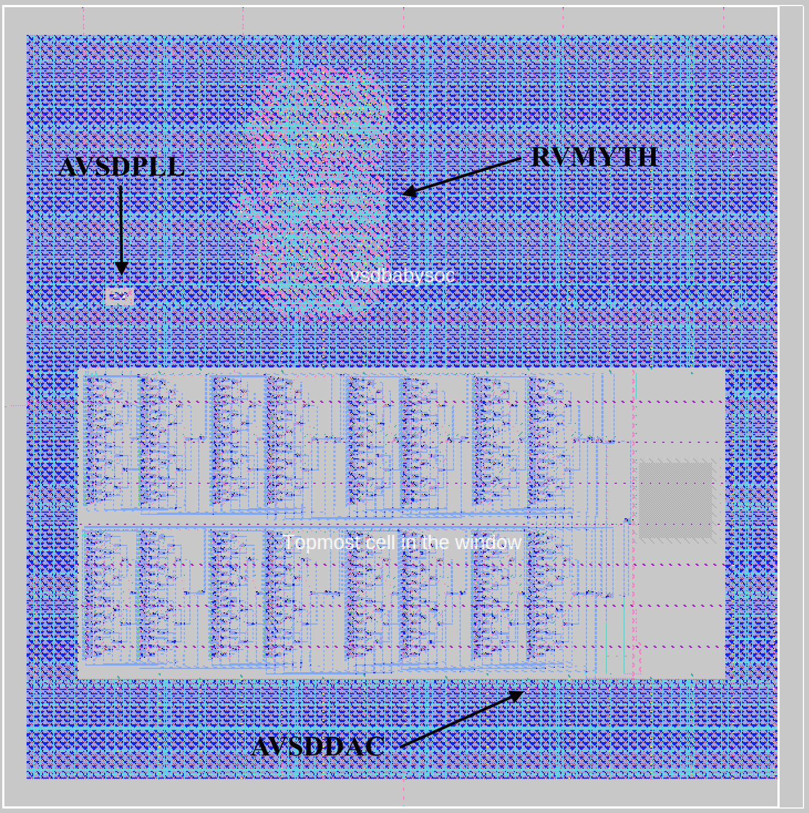

# Future works

Currently our design have some LVS mismatches and about 635 DRC errors. We have to solve these issues to make GDSII layout ready for fabrication.

# Contributors

- [Mohammad A. Nili](https://github.com/manili), M.S. Student at SRBIAU

# Acknowledgements

- [Kunal Ghosh](https://github.com/kunalg123), Co-founder, VSD Corp. Pvt. Ltd.
- [Steve Hoover](https://github.com/stevehoover), Founder, Redwood EDA
- [Shivani Shah](https://github.com/shivanishah269), Research Scholar at IIIT Bangalore
