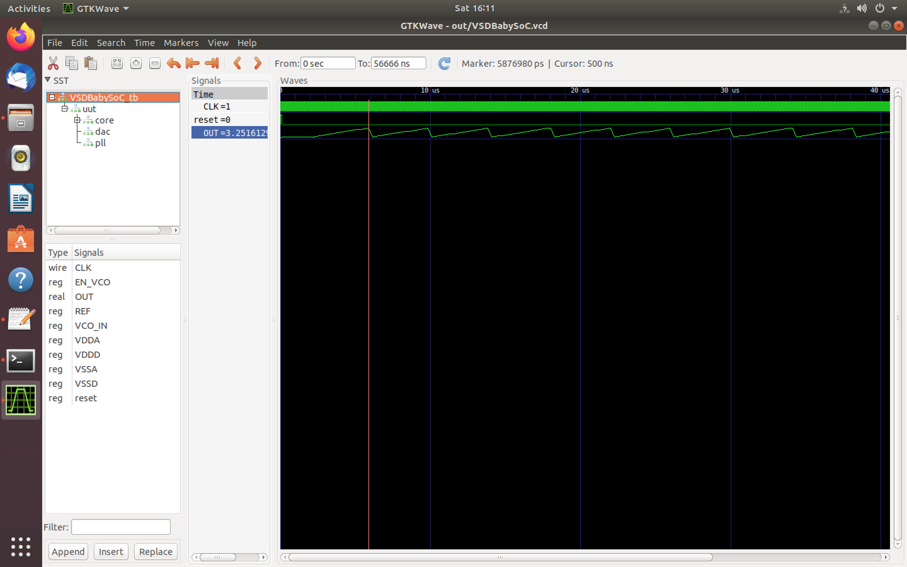

# VSDBabySoC
VSDBabySoC is a small SoC including PLL, DAC and a RISCV-based processor named RVMYTH.

# Table of Contents
- [Introduction to the VSDBabySoC](#introduction-to-the-vsdbabysoc)
  - [Problem statement](#problem-statement)
  - [What is SoC](#what-is-soc)
  - [Why to create the VSDBabySoC](#why-to-create-the-vsdbabysoc)
    - [What is RVMYTH](#what-is-rvmyth)
    - [What is PLL](#what-is-pll)
    - [What is DAC](#what-is-dac)
  - [Modeling steps of the VSDBabySoC](#modeling-steps-of-the-vsdbabysoc)
    - [The abstraction of the whole process](#the-abstraction-of-the-whole-process)
    - [RVMYTH modeling](#rvmyth-modeling)
    - [PLL modeling](#pll-modeling)
    - [DAC modeling](#dac-modeling)
    - [Step by step modeling walkthrough](#step-by-step-modeling-walkthrough)
- [Acknowledgements](#acknowledgements)

# Introduction to the VSDBabySoC


## What is SoC


## Why to create the VSDBabySoC


### What is RVMYTH


### What is PLL


### What is DAC


## Modeling steps of the VSDBabySoC


### The abstraction of the whole process


### RVMYTH modeling


### PLL modeling


### DAC modeling


### Step by step modeling walkthrough

In this section we will walk you through the whole process of modeling the VSDBabySoC in details. We will increase/decrease the digital output value and feed it to the DAC model so we can watch the changes on the SoC output. Please, note that the following commands are tested on the Ubuntu Bionic platform and no other OSes.

  1. First we need to install some important packages:

  ```
  $ sudo apt install python python3-pip git iverilog gtkwave
  $ cd ~
  $ pip3 install sandpiper-saas
  ```

  2. Now you can clone this repository in arbitrary directory (we'll choose home directory here):

  ```
  $ cd ~
  $ git clone https://github.com/manili/VSDBabySoC.git
  ```

  3. It's time to run the compiling script:

  ```
  $ cd VSDBabySoC/Modeling
  $ chmod +x ./compile.sh
  $ ./compile.sh
  ```
  
  Everything will be stored in `out` directory.

  4. You can watch the waveforms with following command:

  ```
  $ gtkwave out/vsdbabysoc.vcd
  ```
  
  Two most important signals are `CLK` and `OUT`. The `CLK` signal is provided by the PLL and the `OUT` is the output of the DAC model. Here is the final result of the modeling process:
  
  

# Acknowledgements
- [Kunal Ghosh](https://github.com/kunalg123), Co-founder, VSD Corp. Pvt. Ltd.
- [Steve Hoover](https://github.com/stevehoover), Founder, Redwood EDA
- [Shivani Shah](https://github.com/shivanishah269), Research Scholar at IIIT Bangalore
