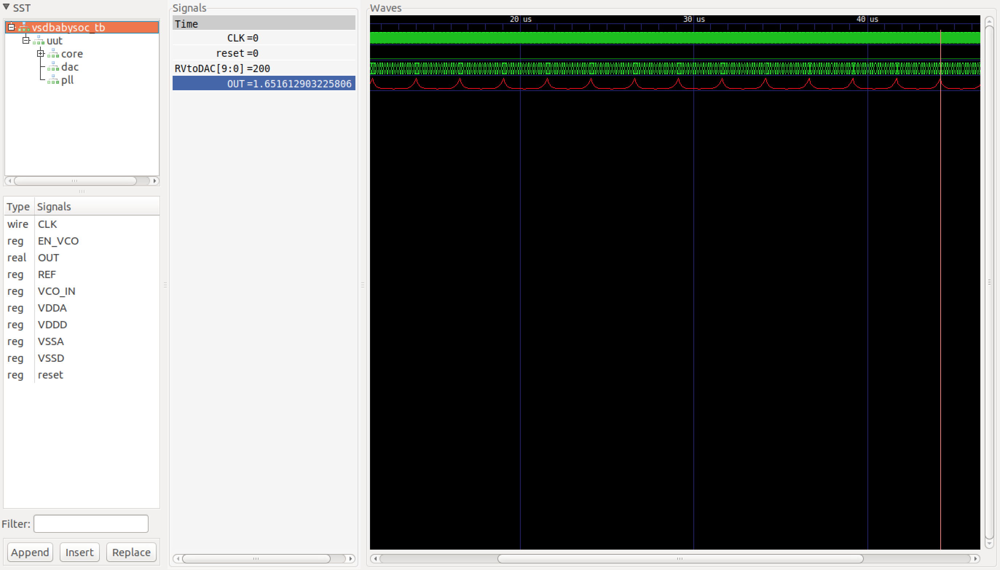

# VSDBabySoC
VSDBabySoC is a small SoC including PLL, DAC and a RISCV-based processor named RVMYTH.

# Table of Contents
- [Introduction to the VSDBabySoC](#introduction-to-the-vsdbabysoc)
  - [Problem statement](#problem-statement)
  - [What is SoC](#what-is-soc)
  - [What is RVMYTH](#what-is-rvmyth)
  - [What is PLL](#what-is-pll)
  - [What is DAC](#what-is-dac)
- [VSDBabySoC Modeling](#vsdbabysoc-modeling)
  - [RVMYTH modeling](#rvmyth-modeling)
  - [PLL modeling](#pll-modeling)
  - [DAC modeling](#dac-modeling)
  - [Step by step modeling walkthrough](#step-by-step-modeling-walkthrough)
- [Acknowledgements](#acknowledgements)

# Introduction to the VSDBabySoC

VSDBabySoC is a small yet powerful RISCV-based SoC. The main purpose of designing such a small SoC is to test three open-source IP cores together for the first time and calibrate the analog part of it. VSDBabySoC contains one RVMYTH microprocessor, an 8x-PLL to generate a stable clock, and a 10-bit DAC to communicate with other analog devices.

## What is SoC

An SoC is a single-die chip that has some different IP cores on it. These IPs could vary from microprocessors (completely digital) to 5G broadband modems (completely analog).

## What is RVMYTH

RVMYTH core is a simple RISCV-based CPU, introduced in a workshop by RedwoodEDA and VSD. During a 5-day workshop students (including middle-schoolers) managed to create a processor from scratch. The workshop used the TLV for faster development. All of the present and future contributions to the IP will be done by students and under open-source licenses.

## What is PLL

A phase-locked loop or PLL is a control system that generates an output signal whose phase is related to the phase of an input signal. PLLs are widely used for synchronization purposes, including clock generation and distribution.

## What is DAC

A digital-to-analog converter or DAC is a system that converts a digital signal into an analog signal. DACs are widely used in modern communication systems enabling the generation of digitally-defined transmission signals. As a result, high-speed DACs are used for mobile communications and ultra-high-speed DACs are employed in optical communications systems.

# VSDBabySoC Modeling

Here we are going to model and simulate the VSDBabySoC using `iverilog`, then we will show the results using `gtkwave` tool. Some initial input signals will be fed into `vsdbabysoc` module that make the pll start generating the proper `CLK` for the circuit. The clock signal will make the `rvmyth` to execute instructions in its `imem`. As a result the register `r17` will be filled with some values cycle by cycle. These values are used by dac core to provide the final output signal named `OUT`. So we have 3 main elements (IP cores) and a wrapper as an SoC and of-course there would be also a testbench module out there.

## RVMYTH modeling


## PLL modeling


## DAC modeling


## Step by step modeling walkthrough

In this section we will walk you through the whole process of modeling the VSDBabySoC in details. We will increase/decrease the digital output value and feed it to the DAC model so we can watch the changes on the SoC output. Please, note that the following commands are tested on the Ubuntu Bionic platform and no other OSes.

  1. First we need to install some important packages:

  ```
  $ sudo apt install python python3-pip git iverilog gtkwave
  $ cd ~
  $ pip3 install sandpiper-saas
  ```

  2. Now you can clone this repository in arbitrary directory (we'll choose home directory here):

  ```
  $ cd ~
  $ git clone https://github.com/manili/VSDBabySoC.git
  ```

  3. It's time to run the compiling script:

  ```
  $ cd VSDBabySoC/src
  $ chmod +x ./pre_synth_sim.sh
  $ ./pre_synth_sim.sh
  ```
  
  Everything will be stored in `out` directory.

  4. You can watch the waveforms with following command:

  ```
  $ cd ../pre_synth_sim
  $ gtkwave pre_synth_sim.vcd
  ```
  
  Two most important signals are `CLK` and `OUT`. The `CLK` signal is provided by the PLL and the `OUT` is the output of the DAC model. Here is the final result of the modeling process:
  
  

# Acknowledgements
- [Kunal Ghosh](https://github.com/kunalg123), Co-founder, VSD Corp. Pvt. Ltd.
- [Steve Hoover](https://github.com/stevehoover), Founder, Redwood EDA
- [Shivani Shah](https://github.com/shivanishah269), Research Scholar at IIIT Bangalore
